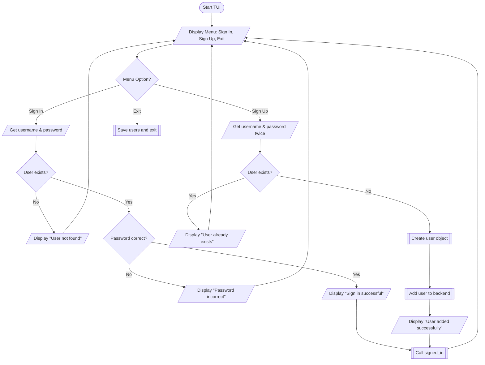
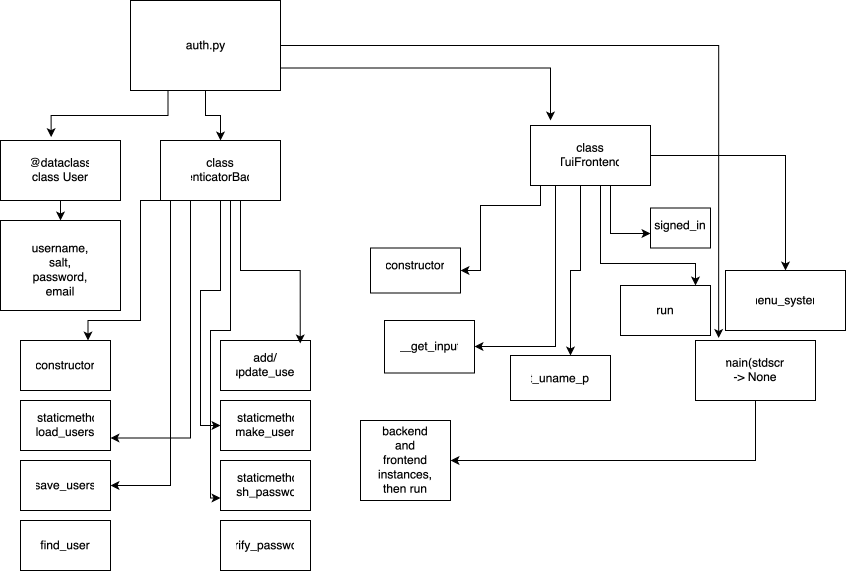
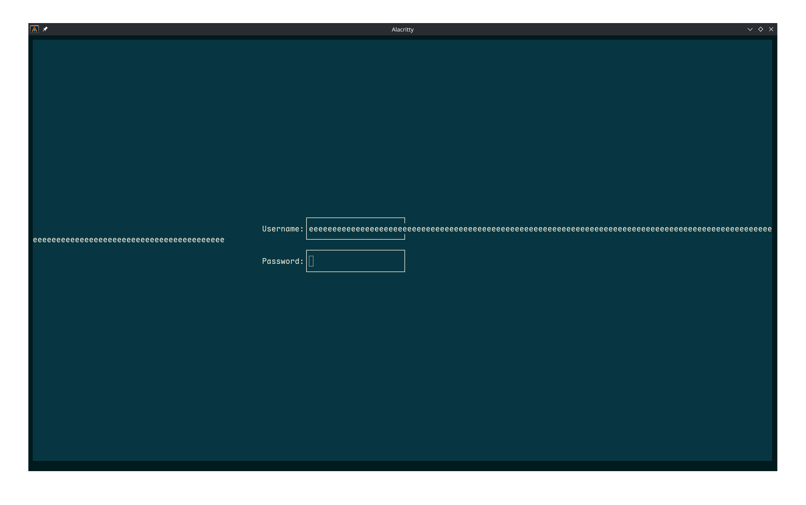

# GCSE Extended Programming Project

## Analysis
The goal of this mini-project is the write a backend and frontend for robust, local, user authentication: implementing modern security. 
### Success critera
- Provide a mostly intuitive user interface (not just a cli tool)
    - Something like a TUI
    - The UI must handle user error gracefully
- Separate the fronted and backed
    - The backend need not know of the frontend
    - Use dependency injection over inheritance
- Have the option to sign in and to sign up, and when signing in, if the user provided an email address and a username, they can use either to sign in
- Use modern hashing algorithms (hashing the password using SHA256 or similar, not just MD5) to store the password, the password must NEVER be kept in plain text
- Store the user credentials in a separate file (a 'database' if you will)
- Helpfully suggest options through the frontend menu system, such as to generate a random password, either randomly or invoking a tool like diceware.
- Allow code to be reusable and useable for other projects that require user auth.
### Main parts
There will be two main sections:
- Backend
- Frontent

The backend handles the database and the password/username lookups, and the frontend provides the user-facing side, with the input fields and text boxes in the terminal. 

## Design
I have not included a full flowchart because the program is quite large, however here's a part of the logic, in a more high-level overview rather than specific implementation, nevertheless showing the processes: 

This is a structure diagram showing all the identifier names for the project:

## Implementation
The fully coded solution to this program is available [here](src/auth.py).
## Testing
Proper testing would involve writing unit tests that would take up approximately 30% of the codebase, and live next to the code, but for this mini-project I just put a simple testing table:
|Test number | Test kind | Test description | Expected outcome  | Actual outcome |
| -----      | -------   | --------------   | ----------------- | -------------  |
| 1.         | Normal    |  J/K navigation  | Menu cycles through options | Output as expected |
| 2.         | Boundary  | Excessively long username (hundreds of characters)     | Username stays in box, and username is accepted in system  | Username text fills up screen overwriting previous characters, but username is nonetheless read and stored in the system just like any other username  |
| 3.         | Invalid   |  (^C escape) | Graceful termination  | KeyboardInterrupt exception raised   |
| 4.         | Erroneous | N/A                  |                |              |

## Evaluation

### The current project
Overall the current project is a success for what it needed to do, because this successfully creates user authentication, properly salting and hashing the password, and the project is written using modern python OOP.  
Nonetheless there are some minor bugs, as discovered during testing, for example the UI breaking when a user enters too much data into a field. This is quite challanging to fix due to the scope of this project because it could involve overhauling the entire frontend to use a more modern or feature-filled framework for terminal control.  
As for terminal control, I did not handle system codes such as 'KeyboardInterrupt' which on one hand makes it simpler and makes error handling more focused on the errors that matter more to the program, and provides an intuitive user experience, however it has the downside of not writing the database to disk before an unclean termination. This means that if a user is added and control-c is hit, that user's data is lost.

### Future steps
If I was to take this project further I could:
- Handle system exit codes in the error handling of the program
- Add proper testing via unit tests, which would integrate testing directly into the project
- Add an option for email sign up instead of username
- Potentially email the user to tell them they signed up
- Overhaul the frontend UI to fix bugs because the curses TUI UI is limiting 

